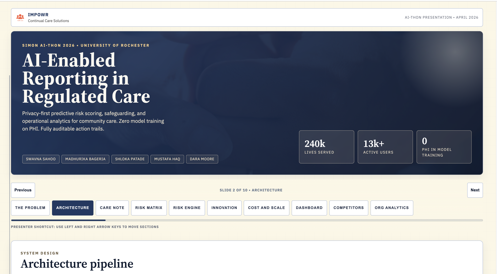

# Impowr · AI Integration in a HIPAA-Regulated Cloud Platform

A secure, compliant AI architecture for a healthcare platform serving at-risk and vulnerable populations.

**Live demo:** [swavnasahoo.github.io/impowr-ai-healthcare](https://swavnasahoo.github.io/impowr-ai-healthcare/)

---

## The problem

Health platforms that serve vulnerable populations sit on a particular kind of tension — the data is exactly the kind of data AI could most usefully act on, and exactly the kind of data HIPAA regulates most strictly. Any AI integration has to assume the worst-case scenario for data leakage and identifier exposure — while still being useful to people on the front lines who don't read JSON.

## What I built

I led a team of five to architect and deploy an AI integration model for Impowr's HIPAA-regulated health platform.

**Secure ingestion and retrieval.** Deterministic tokenization on the Azure ecosystem — Azure SQL for structured records, Azure Blob Storage for unstructured documents, Azure OpenAI for inference — so sensitive identifiers never reach the model layer while still allowing consistent re-linking downstream when authorized.

**Human-readable output.** NLP-driven post-processing layered on top of the AI responses, translating model outputs into clinical and operational insights non-technical staff can act on directly.

## Stack

- **Cloud**: Azure SQL, Azure Blob Storage, Azure OpenAI
- **Security**: Deterministic tokenization for HIPAA-compliant data handling
- **AI / NLP**: Azure OpenAI for generation; custom post-processing for simplification

## My role

Team lead — architecture, Azure environment design, tokenization scheme, NLP post-processing logic, and stakeholder communication with the Impowr team. Four collaborators on implementation and testing.

## Timeline

April 2026.
